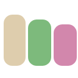
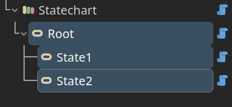

  

# Statechart Sharp

 > A simple statechart plugin for Godot, implemented in C#.

- [Introduction](#introduction)
- [Quick Start](#quick-start)
- [Feature](#feature)
- [Todo](#todo)

## Introduction

What is statechart? Simple put:

- It is a state machine.
- Supports hierarchy state, with various state mode.

This plugin provides basic nodes to build statechart in Godot editor.

## Quick Start

> [!IMPORTANT]
>
> Before you start, You need .NET-enabled version of Godot.

Download repository, copy `addons/statechart_sharp` to your project folder. Build project once, then enable plugin in project setting. It's good if you see new nodes added to "create new node" interface:

**Step 1** : Build with nodes:

- Add Statechart node.

  

- Add State nodes under Statechart.

  

- Add Transition node and Reaction node under State.

  

**Step 2** : Wire up. Set properties and connect signals.

**Step 3** : Build and run.

You can find example scenes in `./statechart_sharp_example` folder. Refer to [per-node manual](./docs/manual.md) to see what these nodes are and how they work together.

## Feature

- Few plugin nodes to learn about.
- Designed for composition. No need to extend scripts.

## Todo

Statechart:

- add save/load method

Example:

- add test scene
- add practical usage
