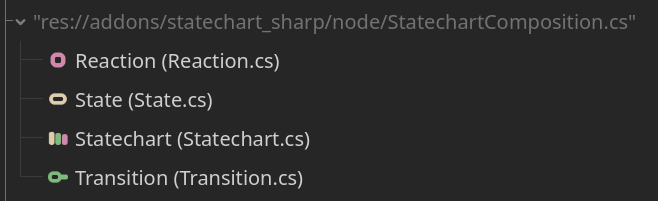
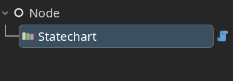
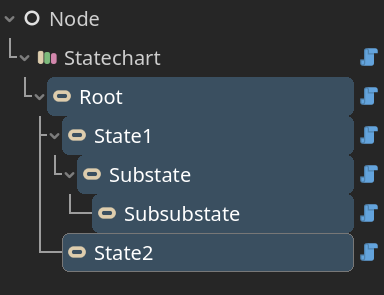
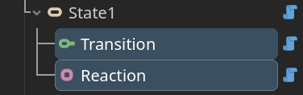

  

# Statechart Sharp

 > A simple statechart plugin for Godot, implemented in C#.

## Table of Content

- [Introduction](#introduction)
- [Start](#start)
- [Specification](#specification)

  - [Statechart](#statechart)
  - [State](#state)
  - [Transition](#transition)
  - [Reaction](#reaction)

- [Todo](#todo)

## Introduction

What is statechart? Simple put:

- It's a state machine.
- Supports hierarchy state, with various state mode.

This plugin provides basic nodes to build statechart in Godot editor.

## Start

> [!IMPORTANT]
>
> Before you start, You need .NET-enabled version of Godot.

Download repository, copy `addons/statechart_sharp` to your project folder. Build project once, then enable plugin in project setting. It's good if you see new nodes added to "Create new node" interface:

**Step 1** : Build with nodes:

- Add  Statechart node

  

- Add  State nodes under statechart.

  

- Add  Transition node and  Reaction node under state.

  

**Step 2** : Wire up. Set properties and connect signals.

**Step 3** : Build and run.

You can find example scenes in `./statechart_sharp_example` folder. Continue to next section to see what these nodes are and how they work together.

## Specification

To get full perspective on statechart, you may refer to:

- https://statecharts.dev/ for conceptual introduction.
- https://www.w3.org/TR/scxml/ for detailed specification.

> [!Caution]
>
> This plugin is a stylized implementation of statechart. Not all definition in SCXML is provided, and details may vary.

### Statechart

The control node of whole statechart. You can simply take it as "state machine" as in common state machine system. To make it work properly, add exactly 1 child `State` node as "root state" (non-history state), which is always active.

At the very beginning, statechart initializes itself, then root state, and all the statechart composition descendant to it. All the composition will be indexed with **"document order"** — the order they showed in an expanded node tree, which is used in most order-considering cases.

`Statechart` provides `Step` method, which is the main way we interact with statechart. Node loop events (process, input, etc.) also call `Step` method. The only difference is that they use built-in event, defined in `util/StatechartConfig.cs` .

During the `Step` method, statechart will do following things:

1. Queue event, if statechart is already running a step. Otherwise, statechart will fetch event from queue, and do following tasks.
2. With fetched event, statechart select transitions from active states.
3. Execute selected transitions.
4. Select and execute auto transitions from active states, do several rounds.
5. With fetched event, statechart invoke reactions from active states.
6. If event queue is not cleared, fetch another event from queue, back to 2.

> [!TIP]
>
> Here's several specification you shall follow:
>
> - Do not manually call `Step` with node loop event, especially when a step is running.
> - Do not call same event from a running step, this may cause unintended endless loop.
> - Better not use `null` event or event with empty string, `Step` won't process. `null` event is used as automatic transition internally.

| Property | Description |
| ---- | ---- |
| `int MaxAutoTransitionRound` | Max iteration rounds of selecting auto transitions in a single step. If `<=0` , statechart will ignore any auto transition. |
| `enum EventFlagEnum EventFlag` | Event flags to control node loop events (process, input, etc.) , which are all disabled by default. |

| Method | Description |
| ---- | ---- |
| `void Step(StringName)` | Make statechart run a step with given event. |

### State

This node works as "state" in common state machine system, while can be arranged in a tree structure, as hierarchical state machine do.

Beware, only a collection of states in the tree are active. Root state is no doubt always active. For the rest, they largely depend on their parent's "state mode": `Compound`, `Parallel`, or `History`. State mode determines how state deal with their child state (substate), and other behaviors when traversing state tree.

`Compound` is the default mode of a state:

- If it is active, then exactly 1 substate (non-history) will be active (if there's any), which is called current state.
- Initial state is the substate a compound will choose as current state by default. You can assign it in inspector, or the first substate (non-history) will be initial state (if there's any).

`Parallel` is to some extent opposite to compund:

- If it is active, then all substate (non-history) will be active.

`History` is a special mode for the state only used as transition's target.

- Never active.
- You can switch whether a history state is deep or shallow.

  - Shallow history only recovers parent's status. For compound parent, it will redirect transition target to the sibling once active till last exit of parent state. For parallel parent, it will redirect transition target to all the non-hisotry siblings.

  - A deep history recovers parent's status as well as descendants'. Redirecting process will be done recursively on redirected targets' substate.

- State may never been active before as a history state's parent. For compound parent, history will be redirected to parent's initial state. For parallel parent, history will be redirected to all non-history siblings.

> [!TIP]
>
> Here's several specification you shall follow:
>
> - Better not append substate to history: state, transition, reaction won't function as history's child. However, you may occasionally assign a history's substate as a transition target, which will cause unexpected behavior.
> - Better not append shallow history to a parallel state. Targeting such history works, but targeting the parallel parent will do the same.
> - Express state with signals and other nodes, not inheritance:
>
>   - State provides `Enter`/`Exit` signals, which will be emitted when state is set active/unactive during a transition.
>   - Transition node is used as a state's child, to represent how this state transits to the other.
>   - Reaction node is used as a state's child, to express what an active state will do.

| Property | Description |
| ---- | ---- |
| `enum StateModeEnum StateMode` | Enumeration of state mode. |
| `bool IsDeepHistory` | Used in history mode only. |
| `State InitialState` | The substate that will be choosed as current state by default. If not assigned, first substate will be initial state (if there's any). Used in compound mode only. |
| `double Delta` | Recently updated delta time parsed from `_Process(double delta)` .  |
| `double PhysicsDelta` | Recently updated delta time parsed from `_PhysicsProcess(double delta)` .  |
| `InputEvent Input` | Recently updated input event parsed from `_Input(InputEvent @event)` .  |
| `InputEvent UnhandledInput` | Recently updated input event parsed from `_UnhandledInput(InputEvent @event)` .  |

| Signal | Description |
| ---- | ---- |
| `void Enter(State)` | Emited when state is entered. Parsed state is used to access delta time and input event when handling node loop events. |
| `void Exit(State)` | Emited when state is exit. Parsed state is used to access delta time and input event when handling node loop events. |

### Transition

This node represents a transition from 1 state to other(s). Append it as child node of a non-history state, then this state will be treated as "source state" — the state we'll transit from. As for the target state(s) — the state(s) we'll transit to, assignment in inspector is required.

First we'll look into how transitions are selected and executed. We have mentioned how statechart runs a `Step` , here we take a further look at step 2 and 3 . To select transitions in step 2, we query active states recursively from root to leaf (with a given event):

- If has no substate, state iterate the transitions appended to itself (with document order). If transition's event matches the given event, transition's `Guard` signal will be emitted, which would be connected to external sripts to judge whether this transition is enabled or not. If a transition is enabled, state will submit it to statechart, stop iteration, and inform parent state that a transition has been selected.
- If substate is the case, then state's mode is considered:

  - For a compound state, first it passes recursion onto its current state (if there's any). If no transition selected in decendants, compound state will look into its own transitions.
  - For a parallel state, it needs to pass recursion onto each non-history substate. If **any** of the substates has not returned with a selected transition, then this state will look into its own transitions

In step 3, with all the states queried, statechart will execute selected transitions with following procedure:

1. Deduce and merge exit set from selected transitions. During the iteration, transition will be disposed if its source state is already in the merging exit set.
2. Exit set excepts from active states. States in exit set emits `Exit` signal in **reversed** document order
3. For selected transitions, emit `invoke` signal in document order.
4. Deduce and merge enter set from selected transitions.
5. Enter set unions with active states. States in enter set emits `Enter` signal in document order.

> [!TIP]
>
> Here's several specification you shall follow:
> 
> - Beware that a transition is enabled by default. If not set disabled during guard, or guard signal is not connected, transitions will be enabled anyway. 

| Signal | Description |
| ---- | ---- |
| `void Guard(Transition)` | Emited when transition is checked. Parsed transition is used to access delta time and input event when handling node loop events. |
| `void Invoke(Transition)` | Emited when transition is invoked. Parsed transition is used to access delta time and input event when handling node loop events. |

| Property | Description |
| ---- | ---- |
| `double Delta` | Recently updated delta time parsed from `_Process(double delta)` .  |
| `double PhysicsDelta` | Recently updated delta time parsed from `_PhysicsProcess(double delta)` .  |
| `InputEvent Input` | Recently updated input event parsed from `_Input(InputEvent @event)` .  |
| `InputEvent UnhandledInput` | Recently updated input event parsed from `_UnhandledInput(InputEvent @event)` .  |

### Reaction

| Signal | Description |
| ---- | ---- |
| `void Invoke(Reaction)` | Emited when reaction is invoked. Parsed reaction is used to access delta time and input event when handling node loop events. |

| Property | Description |
| ---- | ---- |
| `double Delta` | Recently updated delta time parsed from `_Process(double delta)` .  |
| `double PhysicsDelta` | Recently updated delta time parsed from `_PhysicsProcess(double delta)` .  |
| `InputEvent Input` | Recently updated input event parsed from `_Input(InputEvent @event)` .  |
| `InputEvent UnhandledInput` | Recently updated input event parsed from `_UnhandledInput(InputEvent @event)` .  |

## Todo

Statechart:

- add save/load

Example:

- test scene
- practical usage
