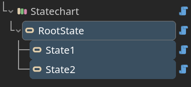

  

# Statechart Sharp

 > A simple statechart plugin for Godot, implemented in C#.

- [Introduction](#introduction)
- [Quick Start](#quick-start)
- [Feature](#feature)

## Introduction

What is statechart?

- A state machine.
- Supports hierarchy states.
- Has various state mode.

This plugin provides basic nodes to build statechart in Godot editor.

## Quick Start

> [!IMPORTANT]
>
> .NET-enabled version of Godot is required.

Download repository, copy `addons/statechart_sharp` to your project folder. Build project once, then enable plugin in project setting. You'll see new nodes added to "create new node" interface:

**Step 1** : Add nodes:

- Add Statechart

  

- Add State(s)

  

- Add Transition(s) and Reaction(s)

  

**Step 2** : Set properties and connect signals.

**Step 3** : Build and run.

Refer to [manual](./docs/manual.md) to see how these nodes work together. Get example scenes in `./statechart_sharp_example` folder.

## Feature

- Follow statechart specification:

  - Use document order.
  - Support automatic transition.

- Designed for Godot:

  - Node based.
  - Support node loop events (process, input, etc.).
  - Choose your style: extend scripts, or use signals only.
