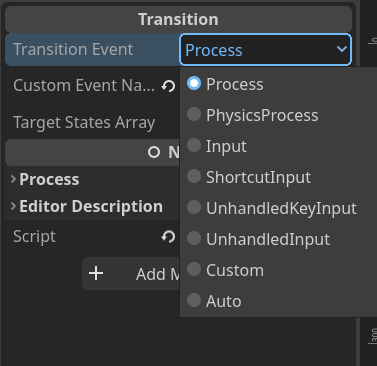
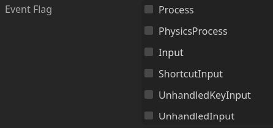

# StatechartSharp 快速上手

## 新的节点

主要的节点就 4 个：

- Statechart ：整个 Statechart 的根节点（你可以把它当作“状态机”节点）
- State ：状态节点。
- Transition ：表示状态之间“转换”的节点。
- Reaction：表示状态“做什么”的节点（规范里称为 action ，但是太冲突了就改成 reaction）。

还有一个 TransitionPromoter 节点，是用来提升 Transition 优先级的。

使用这些节点可以在编辑器中搭建。节点还提供了一些信号，可以让你不用扩展脚本就能实现状态机具体内容。

## 搭建简单状态机

你完全可以把 Statechart 当作基础的状态机来使用。

首先创建一个 Statechart 节点，然后添加一些 State 节点。注意我们需要一个根状态节点（即使你的状态机是单层的），在根节点下再放置更多的状态节点。

注意 State 节点放置的顺序是**有影响**的，包括之后要用的 Transition 、 Reaction 。这些节点（展开所有层级）在编辑器中**从上到下**的顺序叫做”文本序“（Document order），各种遍历操作都要用。

状态机初始会默认激活第一个状态，然后继续激活它的子状态中第一个状态。比方说你要做一个角色控制器，你会希望初始是静止的”IDLE“状态：

```
Player
    └─Statechart
        └─Root // <- 初始激活的状态
            ├─Idle // <- 初始激活的状态
            ├─Walk
            └─Airborne
```

然后你可能就想，是不是要和其他那些状态机教程一样要开始编写 `StateIdle.cs` `StateWalk.cs` 这样的脚本，放在 `./scripts/player/states` 这样的文件夹里……别急。扩展脚本也是可以的，但我们这个插件可以让你完全使用信号！另外我们的状态节点只关心”进入“和”离开“时需要做什么（Enter/Exit 信号），而状态转换、状态”平时做些什么“分别是由 Transition 、 Reaction 节点表示。

那么我们先添加一些 Transition 节点。Transition 是隶属于某一个状态的，我们把它添加为某个状态节点的孩子，就表示从这个状态出发的转换：

```
Statechart
    └─Root
        ├─Idle
        │   └─ToWalk // <- 从 Idle 到 Walk 的转换
        ├─Walk
        └─Airborne
```

至于转换的目标状态，你可以在 Transition 的 Targets 属性里添加。

设置好转换目标后，我们还需要判断转换是否真的要发生。比方说检测角色是否从地面转移到空中，一般是在 PhysicsProcess 阶段使用 `CharacterBody.IsOnFloor()` 。这里我们不扩展脚本，而是连接一个 `void Guard(StatechartDuct)` 信号：意味着你需要一个函数，具有 `void` 返回值，以及接受一个 `StatechartDuct` 参数。比方说你的角色控制器脚本 Player 继承自 CharacterBody2D/3D ，你可以在 Player 脚本里编写这个函数，使用节点的信号系统连接到 Transition 节点的 Guard 信号上：

```csharp
public void GroundToAir(StatechartDuct duct)
{
    duct.IsEnabled = !IsOnFloor();
}
```

信号的参数 StatechartDuct 是状态机用于与外界交流的对象。比方说此处 Transition 想要知道它是否需要执行转移，发射 Guard 信号，而我们编写的外部函数就通过修改 `bool StatechartDuct.IsTransitionEnabled` 成员告诉状态机是否发生转移。这个值在每次通过信号传递之前都会被设为 true ，所以你不连接 Guard 信号，或是没有在连接的函数中改变这个值，那么状态转移会默认激活。

最后我们还要确定状态转移的判断、发生的时机（事件）：可以选择属性中的 TransitionEvent ，你会看到有 Process 、 Input 等节点生命周期函数对应的事件。这里我们选 PhysicsProcess 。



设定完 Transition ，我们回到 Statechart 节点，可以看到有 EventFlag 可以勾选。默认是都不勾选的，Statechart 也就不会响应任何生命周期函数事件。你可以根据需要勾一下，比方说我们刚刚添加的转移需要 PhysicsProcess ，之后要捕捉鼠标运动旋转视角需要 UnhandledInput 。



此时我们状态还并不会做任何事情，State 也没有供重写的方法表示状态做什么。取而代之的是添加 Reaction 子节点，我们连接它的 Invoke 信号，类似地也会传递 StatechartDuct 对象，而我们编写的外部函数可以从中获取节点周期函数的参数，如帧时间 Delta ，或是输入事件 Input 。类似于 Transition ，Reaction 也要选择发生的时机/事件（Process、Input 等）。

```
Statechart
    └─Root
        ├─Idle
        │   └─ToWalk
        ├─Walk
        │   └─Reaction // <- Walk 状态的行为
        └─Airborne
```

现在我们的单层状态机已经有基本的功能了。当然我们忽略了很多细节和 Statechart 独有的特性，你可以参考[手册](manual.md)，配合项目中的测试样例了解更多。

